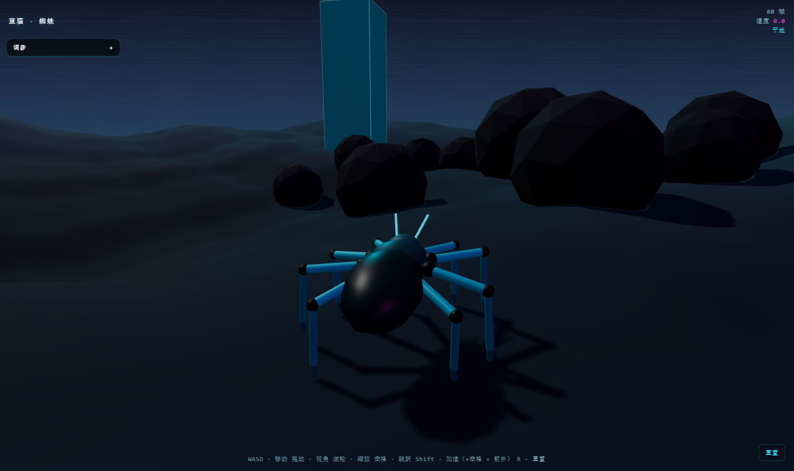

<div align="center">

# 🕷️ 蓝猫蜘蛛

> *「没有一帧动画，没有一根骨骼，没有物理引擎 —— 它每一步都是现算出来的。」*




**一只纯数学驱动的自稳定程序化蜘蛛：8 条腿用闭式逆运动学（IK）实时解算，身体随坡度、墙面、悬垂自动倾斜，还能起跳扒住墙壁——全程无动画片段、无骨骼绑定、无物理引擎，每一帧都是现算。**

<sub>拖动滑块、开着它到处跑，看八条腿自己找落脚点——意外地解压。</sub>

[看效果](#-效果示例) · [快速开始](#-快速开始) · [特性](#-它凭什么不一样) · [操作](#-操作) · [工作原理](#-工作原理) · [English](#english)

</div>

---

## 🔥 效果示例

开着它爬上斜坡、扒上竖直的墙、翻过石块——**身体会像真蜘蛛一样在腰部弯折**，肚子挂下来、随重心下垂；八条腿各自在世界里找落脚点，你加速、减速、转弯时步态自动重新计时。

<div align="center">

</div>

> **它的特别之处不在“建了一只蜘蛛模型”，而在这只蜘蛛的每一个姿态都是从世界现场推导出来的——地形是公式、IK 是公式、碰撞是距离函数，没有任何预烘焙的动画。**

## 🚀 快速开始

```bash
pnpm install
pnpm dev        # http://localhost:5173
```

打生产包（`dist/` 丢到任意静态托管即可——GitHub Pages、itch.io、一个普通文件夹）：

```bash
pnpm build
pnpm preview    # 本地预览生产构建
```

需要 Node 18+。运行时依赖只有一个 `three`。

## ✨ 它凭什么不一样

| 特性 | 说明 |
|---|---|
| **解析式 IK 腿** | 每条腿用两骨闭式解算（髋→膝→足）。不烘焙动画、不迭代收敛：一个公式，精确，每帧算一次。 |
| **即兴步态** | 脚落在世界里、不是绑在身体上。身体跑过某只脚太远，那条腿就抬起、划弧、落到新落脚点。步态是交替式状态机，会随你的快慢与转向自然重新计时。 |
| **地形是函数，不是网格** | 地面是闭式高度场，能在任意点采到精确高度**和法线**——这正是落脚与身体对齐稳如磐石的原因。 |
| **爬墙与倒挂** | 身体的“上方向”向脚下表面法线混合，于是它会贴上斜面、扒住陡壁，而不是穿模或下滑。 |
| **会弯的身体** | 头胸部 + 腹部由柔性腹柄相连，腹部在腰处弯折：贴墙时垂下、过山脊时下坠、自重下微沉。像真蜘蛛，不是刚性一坨。（开关：**身体弯折**） |
| **膝摆避障** | 每条腿在一扇形膝朝向里搜索，挑出最不穿地/穿障的那个（可实时调）。 |
| **实时调参面板** | 速度、离地高度、抬脚高度、步频、转向、步幅、膝摆搜索，全部边走边调。 |
| **小而轻** | ~1200 行、8 模块，运行时只依赖 `three`，跑数百 FPS。 |
| **桌面与触屏** | WASD + 鼠标，或手机/平板上的屏幕摇杆。 |

## 🎮 操作

| 动作 | 桌面 | 触屏 |
|---|---|---|
| 移动 | `W` `A` `S` `D` / 方向键 | 左摇杆 |
| 视角 | 拖动鼠标 | 右侧拖动 |
| 缩放 | 滚轮 | — |
| 加速 | 按住 `Shift` | **加速** 按钮 |
| 跳跃 | `空格` | **跳跃** 按钮 |
| 重置 | `R` 或 **重置** 按钮 | **重置** 按钮 |

右上角 HUD 显示实时帧率、速度，以及蜘蛛所处的**地面等级**（`平地` → `斜坡` → `墙面` → `倒挂`）。

## 🧠 工作原理

蜘蛛从不播放动画。它每一帧都从世界现场重新推导出整个姿态：

1. **输入 → 意图**：键盘/摇杆变成一个期望的移动方向与速度。
2. **身体控制器**：身体转向意图、越过地形前进，并在**由已落地的脚构成的支撑平面**之上保持目标离地高度，同时倾斜“上方向”去贴合——于是它靠上斜坡、爬上台阶、扒住墙壁，从不陷进上升的地面。
3. **步态状态机**：八条腿共享一个交替四足式的计时轮。脚**在世界坐标里保持不动**、身体从它上方移过；一旦身体把某条腿拉过步幅阈值，那条腿进入一次**迈步**——抬起、划弧、落到新落脚点。
4. **落脚搜索**：新落脚点从解析地形高度**加上**碰撞体余隙一起采样，所以脚落在真实几何上——包括竖直面和倒置面。
5. **两骨 IK**：给定髋位置、足目标、股/胫长度，膝角用闭式解出；再用一小段**膝摆**搜索把膝平面转到最不穿地/穿障的朝向。
6. **相机**：第三人称跟随相机拖在身后，几何体会挡镜头时自动拉近。

一切都是**解析式**——地形是公式、IK 是公式、碰撞是距离函数。没有物理解算器、没有骨骼、没有动画数据。

> IK 解算器面板里可切换 `解析式` ↔ `分解式`：分解式解法（源自 Kiaran Ritchie, 2026）把每条腿拆成“链长”（在肢体静止坐标系里解）与“链向”（绕髋的一次瞄准旋转），落脚点两种解法一致，但**膝弯**变成由基座驱动，像真实的髋关节窝。切一下，盯着膝盖看。

## 👤 关于作者

**蓝猫 · BlueCat** —— AI-native builder，做能上线的中英日三语产品。

| | |
|---|---|
| 🌐 站点矩阵 | [bluecatbot.com](https://bluecatbot.com) |
| 🐙 GitHub | [@shushuitie2017](https://github.com/shushuitie2017) |

<div align="center">
<br>
<sub>👆 微信扫码，聊 Three.js / 程序化动画</sub>
</div>

### 也在做

- 🎮 **[Three.js Skills](https://github.com/shushuitie2017/threejs-skills)** —— 把 9 个 Three.js 游戏开发技能装进 AI Agent，一句话造一个能玩的浏览器 3D 游戏
- 🧊 **[蓝猫 3D](https://3d.bluecatbot.com)** —— AI × 3D 角色产线的工具榜单 + 九步实战课
- 🎨 **[矢安 SVGSafe](https://svg.bluecatbot.com)** —— 授权清晰的免费 SVG 图标 / 插画库

## 📄 许可证

**MIT —— 随便用，随便改，随便造。**

---

## English

**蓝猫蜘蛛 (BlueCat Spider)** is a Chinese adaptation of a self-stabilizing procedural spider you can walk over any terrain — eight legs solved with closed-form inverse kinematics, an improvised gait, and a body that leans into slopes, walls, and overhangs, with **no animation clips, no skeleton rig, and no physics engine.** Just math, every frame. Built with Three.js.

```bash
pnpm install && pnpm dev     # http://localhost:5173
```

~1,200 lines across 8 modules, `three` as the only runtime dependency, hundreds of FPS. Desktop (WASD + mouse) and touch (on-screen joystick). MIT licensed.

---

<div align="center">

*没有一帧动画，没有一根骨骼 —— 它每一步都是现算出来的。*

**[🐙 GitHub · shushuitie2017/bluecat-spider](https://github.com/shushuitie2017/bluecat-spider)**

</div>
